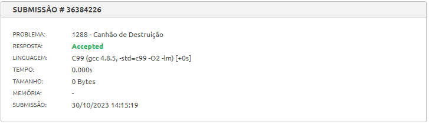

# Exercícios Juiz Online

- **Número da Lista**: 31
- **Conteúdo da Disciplina**: Greed

## Alunos
| Matrícula  | Aluno                   |
| ---------- | ----------------------- |
| 18/0102761 | Jefferson França Santos |
| 20/0049879 |  Yago Milagres Passos   |

## Sobre 
Exercícios do Beecrowd com nível 5 ou mais.
  
Exercícios escolhidos:

- [Canhão de Destruição - 1288: ](https://www.beecrowd.com.br/repository/UOJ_1288.html)No jogo "Canhão de Destruição", você deve destruir um castelo com resistência R. Você tem um canhão com capacidade K e vários projéteis de chumbo com poder de destruição X e peso Y. Sua missão é carregar o canhão com projéteis de forma a maximizar o dano ao castelo sem exceder a capacidade de carga do canhão. Se o dano total causado pelos projéteis for maior ou igual a R, você vence ("Missao completada com sucesso"). Caso contrário, é uma derrota ("Falha na missao").
- [War - 2095](https://www.beecrowd.com.br/judge/en/problems/view/2095)Nesse desafio, você deve aconselhar a rainha de Nlogonia a enviar seus soldados para a guerra de acordo com sua "skill". Recebemos uma informação sobre a ordem de envio dos soldados do reino inimigo: Quadradonia, juntamente com seus níveis de "skill". Então a ideia é rodar um algorítmo ambicioso para enviarmos nossos soldados Ngolonianos de forma que vençamos mais batalhas. 

## Screenshots

## Especificação
**Linguagem**: C 

## Uso 

Para rodar os programas, você só precisa fazer o download dos códigos e carregá-los em um [compilador online](https://www.onlinegdb.com/online_c_compiler) ou em um editor de código-fonte e instalar com um compilador C de sua preferëncia. Também pode-se copiar os códigos dos problemas, presentes nas pastas desse repositório, e colá-los direto em seus respectivos links do [beecrowd](https://www.beecrowd.com.br/)

## Outros 

