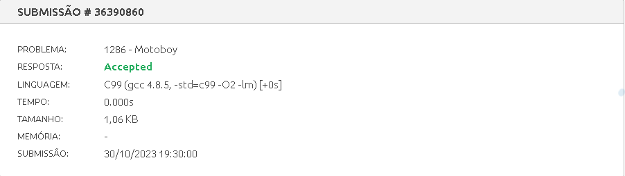
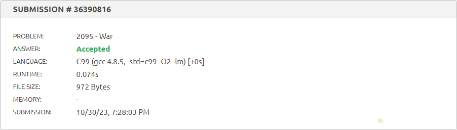
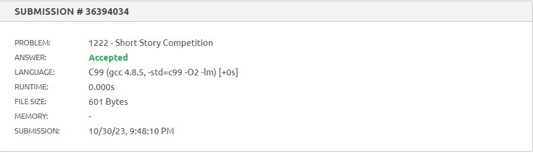

# Exercícios Juiz Online

- **Número da Lista**: 29
- **Conteúdo da Disciplina**: Algorítmos Ambiciosos

## Alunos
| Matrícula  | Aluno                   |
| ---------- | ----------------------- |
| 18/0102761 | Jefferson França Santos |
| 20/0049879 |  Yago Milagres Passos   |

## Sobre 
Exercícios do Beecrowd com nível 5 ou mais.
  
Exercícios escolhidos:

- [Motoboy - 1286](https://www.beecrowd.com.br/repository/UOJ_1286.html): José é um motoboy que entrega pizzas e seu amigo Roberto o ajuda a fazer entregas demoradas. Para dividir o trabalho, José escolhe os pedidos mais demorados para Roberto. Cada pedido tem um tempo de entrega e uma quantidade de pizzas. O objetivo é determinar quanto tempo Roberto levará para entregar as pizzas escolhidas por José. A entrada contém o número de pedidos, o número máximo de pizzas que Roberto pode entregar e informações sobre cada pedido. O programa calcula o tempo total para os pedidos selecionados e imprime esse tempo em minutos para cada caso de teste. O processo é repetido para vários casos de teste até que N seja igual a zero.

- [Canhão de Destruição - 1288](https://www.beecrowd.com.br/repository/UOJ_1288.html): No jogo "Canhão de Destruição", você deve destruir um castelo com resistência R. Você tem um canhão com capacidade K e vários projéteis de chumbo com poder de destruição X e peso Y. Sua missão é carregar o canhão com projéteis de forma a maximizar o dano ao castelo sem exceder a capacidade de carga do canhão. Se o dano total causado pelos projéteis for maior ou igual a R, você vence ("Missao completada com sucesso"). Caso contrário, é uma derrota ("Falha na missao").

- [War - 2095](https://www.beecrowd.com.br/judge/en/problems/view/2095): Nesse desafio, você deve aconselhar a rainha de Nlogonia a enviar seus soldados para a guerra de acordo com sua "skill". Recebemos uma informação sobre a ordem de envio dos soldados do reino inimigo: Quadradonia, juntamente com seus níveis de "skill". Então a ideia é rodar um algorítmo ambicioso para enviarmos nossos soldados Ngolonianos de forma que vençamos mais batalhas.

- [Short Story Competition - 1222](https://www.beecrowd.com.br/judge/en/problems/view/1222): Você é encarregado em ajudar um escritor brasileiro chamado Machado a estruturar a sua nova história para a competição. Essa possui muitas regras, onde há um número máximo de Linhas por página e caracteres por linha, então, você deve receber o a história de machado e retornar a quantidade mínima de páginas em que a história pode ser feita, seguindo as regras da competição.

## Screenshots

## Especificação
**Linguagem**: C 

## Uso 

Para rodar os programas, você só precisa fazer o download dos códigos e carregá-los em um [compilador online](https://www.onlinegdb.com/online_c_compiler) ou em um editor de código-fonte e instalar com um compilador C de sua preferëncia. Também pode-se copiar os códigos dos problemas, presentes nas pastas desse repositório, e colá-los direto em seus respectivos links do [beecrowd](https://www.beecrowd.com.br/)

## Vídeo

O arquivo do vídeo está disponível [aqui](apresentação.mp4)
